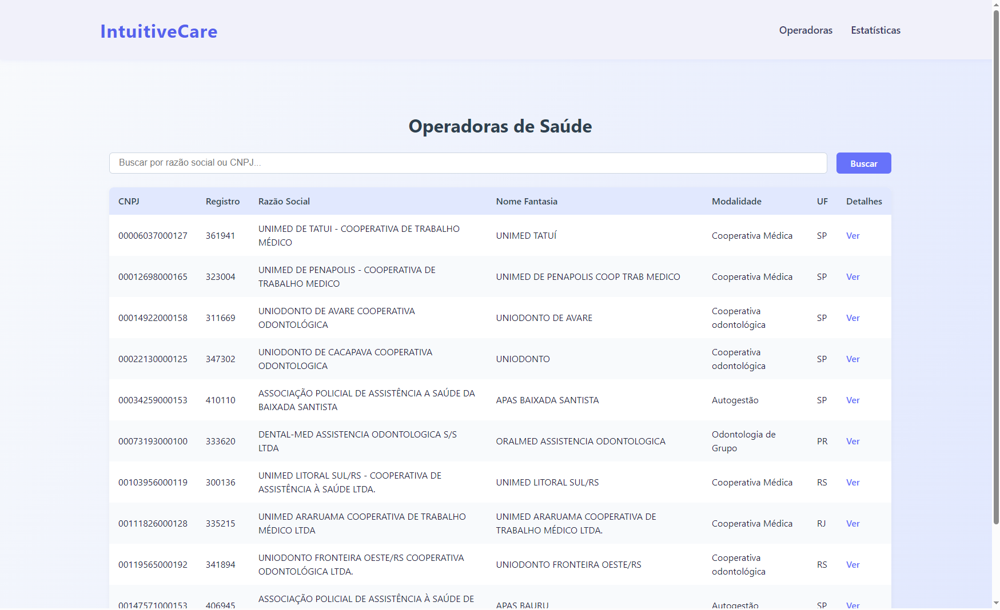
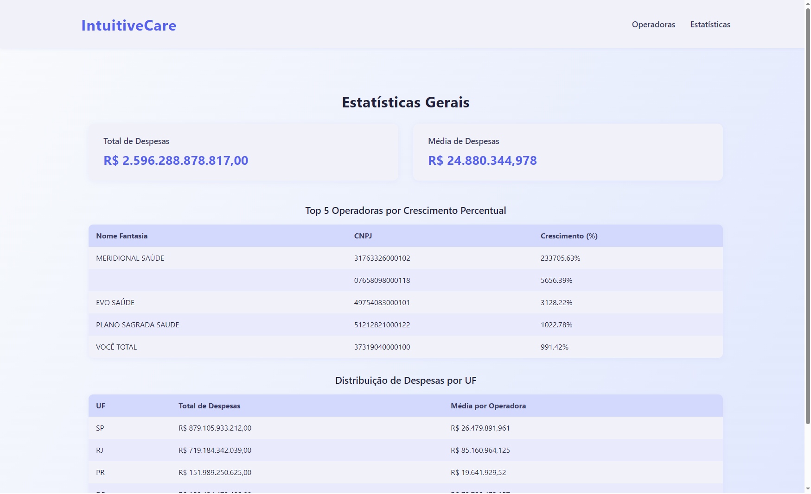
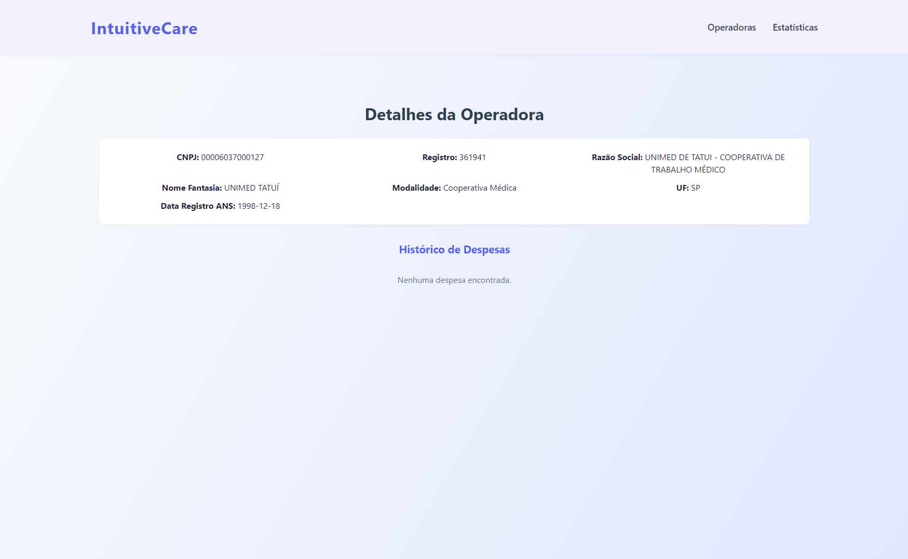

# IntuitiveCare

## Sumário
1. [Introdução](#introdução)
2. [Estrutura do Projeto](#estrutura-do-projeto)
3. [Como Rodar o Projeto](#como-rodar-o-projeto)
4. [Etapas do Projeto](#etapas-do-projeto)
    - [1. Integração API](#1-integração-api)
    - [2. Transformação e Validação](#2-transformação-e-validação)
    - [3. Banco de Dados](#3-banco-de-dados)
    - [4. API e Interface Web](#4-api-e-interface-web)
5. [Seção de Prints](#seção-de-prints)

## Introdução
Este teste foi desenvolvido para realizar a integração, transformação, validação e visualização de dados relacionados às despesas de operadoras de saúde. Ele é dividido em quatro etapas principais, cada uma com sua funcionalidade específica.

## Estrutura do Projeto
A estrutura do projeto está organizada da seguinte forma:

```
1_integracao_api/
2_transformacao_validacao/
3_banco_dados/
4_api_e_interface_web/
```

Cada pasta contém seus próprios arquivos de código, dados e scripts necessários para sua execução.

## Como Rodar o Projeto

### Pré-requisitos
- **Java** (para as etapas 1 e 2)
- **MySQL** (para a etapa 3)
- **Python 3.9+** e **Node.js** (para a etapa 4)

### Passo a Passo
1. Clone o repositório:
   ```bash
   git clone https://github.com/Baphomet/IntuitiveCare
   cd Teste_IntuitiveCare
   ```

2. **Etapa 1 e 2 (Java):**
   - Compile e execute os arquivos `MainIntegracaoApi.java` e `MainTransformacaoValidacao.java` nas pastas `1_integracao_api/src` e `2_transformacao_validacao/src`.

3. **Etapa 3 (Banco de Dados):**
   - Configure o MySQL e execute os scripts SQL na pasta `3_banco_dados/sql` na seguinte ordem:
     1. `01_create_tables.sql`
     2. `02_load_data.sql`
     3. `03_queries_analiticas.sql`

4. **Etapa 4 (API e Interface Web):**
   - Backend:
     ```bash
     cd 4_api_e_interface_web/backend
     python -m venv venv
     source venv/bin/activate # No Windows: venv\Scripts\activate
     pip install -r requirements.txt
     uvicorn app.main:app --reload
     ```
   - Frontend:
     ```bash
     cd ../frontend
     npm install
     npm run dev
     ```

5. Acesse o site no navegador em `http://localhost:5173`.

## Etapas do Projeto

### 1. Integração API
- Local: `1_integracao_api`
- Função: Realiza a integração com APIs externas para coletar dados brutos.
- Detalhes: Consulte o arquivo `README.md` dentro da pasta para mais informações.

### 2. Transformação e Validação
- Local: `2_transformacao_validacao`
- Função: Transforma e valida os dados coletados, gerando arquivos prontos para análise.
- Detalhes: Consulte o arquivo `README.md` dentro da pasta para mais informações.

### 3. Banco de Dados
- Local: `3_banco_dados`
- Função: Cria as tabelas, carrega os dados transformados e executa consultas analíticas.
- Detalhes: Consulte o arquivo `README.md` dentro da pasta para mais informações.

### 4. API e Interface Web
- Local: `4_api_e_interface_web`
- Função: Fornece uma API para acesso aos dados e uma interface web para visualização.
- Detalhes: Consulte o arquivo `README.md` dentro da pasta para mais informações.

## Seção de Prints
Adicione aqui os prints do site para documentar as funcionalidades visuais:

- **Página Inicial:**
  

- **Estatísticas:**
  

- **Detalhes da Operadora:**
  

## Observações Adicionais
- Uma coleção do Postman está disponível na pasta `backend/postman` para testar todas as rotas da API. Inclui exemplos de requisições e respostas esperadas.
